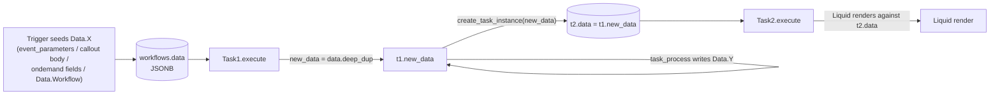

# Workflow data flow: how `Data.*` is built and validated

> Companion to [`workflow-task-templates.json`](workflow-task-templates.json) (`data_contract` blocks) and [`workflow-task-catalog.md`](workflow-task-catalog.md). Read this before planning any multi-task workflow so you can statically reason about which `{{ Data.X.Y }}` Liquid references are actually resolvable at each step.

## 1. The mental model

Every task receives a single Ruby Hash called `data` from the previous task. After it runs, it produces a new Hash called `new_data`, which becomes the next task's `data`. Liquid templates inside any task's `parameters` reference this hash under the top-level key `Data`:

```text
{{ Data.Invoice.Id }}            → data["Invoice"]["Id"]
{{ Data.Invoice[0].Number }}     → data["Invoice"][0]["Number"]
{{ Data.Files.invoice_export.name }} → data["Files"]["invoice_export"]["name"]
```



The Rails source of truth lives on each task class:

| Method | Returns | What it controls |
|---|---|---|
| `Task#objects` | `{ <key> => 1 \| 2 \| 0 }` (Hash, Array, File) | Shape of `Data.<key>` written by this task. |
| `Task#data_structure` | `{ <key> => [field1, field2, …] }` | Concrete field names downstream tasks may statically reference. |
| `Task#fake_payload` | A synthetic `Data` hash | Used at save time to **validate Liquid references** in this task's parameters (`Workflow::Setup#import` runs `template_parse` against `fake_payload`). |
| `Task#task_process` | (mutates `self.new_data`) | The actual runtime task that produces output. Predictability of its writes determines our category below. |

`Task#execute` (`task.rb:1112`) sets `self.new_data = self.data.deep_dup`, calls `task_process(**execute_params)`, and at hand-off `iterate_tasks → create_task_instance(self.new_data, ...)` (`task.rb:1704-1712`) **assigns the predecessor's `new_data` as the next task's `data` JSONB column**. So the next task starts with everything its predecessor had, plus whatever the predecessor wrote.

The linter (`scripts/lint-workflow-json.js`, rules `E170` / `W171` / `W172` / `W173` / `W174`) mirrors this walker using the per-task `data_contract` block in `workflow-task-templates.json`.

## 2. Predictability categories

Every task is classified into one of five categories. The agent (and the linter) uses this to decide what level of validation is possible at design time.

| Category | What we know at design time | Examples | Linter behaviour |
|---|---|---|---|
| **DETERMINISTIC** | Both the **scope** (`Data.X`) and the **field shape** (`X.field1, X.field2, …`) are known from the task model + parameters. | `Query`, `Create`, `Update`, `CustomObject::Query`, `CustomObject::Create`, `CustomObject::Update`, legacy SOAP amendments (`NewProduct`, `RemoveProduct`, `Suspend`, `Resume`, `Cancel`), `InvoiceGenerate`, `Billing::ReverseInvoice`, `Payment::GatewayReconciliation` | Validates `Data.X.<field>` references; emits `W171` if the field isn't in the contract. |
| **SEMI-DETERMINISTIC** | The **scope** is known; the **field shape** is partially known (standardized model fields), or the contents come from a free-form expression (e.g., GraphQL selection set, Liquid ``s, report column names). | `Export`, `Billing::BillRun`, `Payment::PaymentRun`, `Data::BillingPreviewRun`, `Data::Aqua`, `Data::Link`, `GraphQuery`, `Logic::Liquid`, `Reporting::RunReport`, `Reporting::OracleFusionReport`, `File::DownloadFile`, `File::ZuoraImport`, `File::FileOperations`, `File::FileStreamingUpload`, `File::BulkDataLoader`, `File::CustomPDF::CustomDocument`, `Billing::CurrencyConversion`, `Billing::CustomBillingDocument`, `Usage::ImportUsage`, `Attachment`, `Download::SFTP`, `Download::S3` | Scope-level validation only. `W171` is downgraded to a notice (`fields_partial_known`). |
| **OPAQUE** | The **scope** is known (or can be derived from `placement`); the **field shape is unknowable** until runtime. | `Callout`, `AsynchronousCallout`, `Logic::Lambda`, `Script::JavaScript`, `Logic::JSONTransform`, `Logic::XMLTransform`, `Logic::CSVTranslator`, `Logic::ResponseFormatter`, `Execute::WorkflowTask`, `Mediation::SendEvents` | Downstream `Data.<scope>.<field>` references emit `W172` unless the task carries `parameters._opaque_trusted = "true"` or `parameters._expected_response_schema = {...}`. |
| **SCOPING** | The task **does not produce new positive writes**; it **routes execution** along branches and/or **rebinds** an existing scope. | `If`, `Logic::Case`, `Iterate`, `Logic::Merge`, `Approval`, `Delete`, `CustomObject::Delete` | `Iterate` triggers `W173` if a downstream task references the iterated scope as an array. `Logic::Case` triggers `W174` if a downstream task references a scope that's only produced on some branches. |
| **NONE** | Side-effect-only or non-data tasks: writes nothing into `Data.*`. | `Email`, `Notifications::SMS`, `Notifications::Kafka`, `Delay`, `UI::Page`, `UI::Stop`, `UI::WebShare`, `Upload::FTP`, `Upload::SFTP`, `Upload::S3`, all `UsageMediation::*`, `File::CustomPDF::CustomDocument` (file-only) | No writes contributed; downstream tasks see only what predecessors wrote. |

These categories live in `workflow-task-templates.json` as `data_contract.predictability` on every task entry. The default fallback (`$default_data_contract`) is `opaque` so the linter is conservative for unknown task types.

## 3. What's in `Data` before any task runs (per-trigger seeding)

These are the workflow-level seeds — always available even at task #1:

| Key | Source | Trigger types that populate it |
|---|---|---|
| `Data.Workflow.ExecutionDate` | `Workflow#data_structure` (workflow.rb:344-349) | **all** |
| `Data.Workflow.ExecutionDateTime` | same | **all** |
| `Data.Workflow.Name` / `Data.Workflow.Id` / `Data.Workflow.Tenant` / `Data.Workflow.User` | same | **all** |
| `Data.UIAction.{ObjectId, ObjectName, ObjectNumber}` | `Workflow#data_structure` when `call_type == 'UIACTION'` | **uiaction** workflows |
| `Data.<Object>.<field>` for every entry in `workflow.parameters.fields[]` | `Workflow#objects` | **ondemand** & **scheduled** & **uiaction** |
| `Data.<EventObject>.<key>` for every entry in `workflow.parameters.event_parameters[]` | `BusinessEvent.create_workflow_from_event_message` (business_event.rb:123-201), then `Workflow::Instance#set_data` (workflow/instance.rb:114-201) | **event** triggers (Notifications EventTrigger / ScheduledEvent) |
| `Data.Callout.<...>` (or whatever placement was configured on the inbound trigger) | The HTTP body of the inbound POST | **callout** triggers (Api::V1::WorkflowsController#run, ll. 493-537) |

Per-trigger summary:

- **event_trigger**: seed = `Data.Workflow.*` + every `event_parameters[].object/key` declared on the workflow. The keys you list in `event_parameters` are *exactly* what's available; if you list `BillingRun.Id` then `Data.BillingRun.Id` is seeded — nothing else from the event payload comes through.
- **callout_trigger**: seed = `Data.Workflow.*` + the inbound HTTP body merged in at the configured root key (default `Data.Callout.*`). Treated as **OPAQUE** by the linter — declare `_expected_response_schema` on the workflow envelope's `parameters` to enable field-level validation.
- **ondemand**: seed = `Data.Workflow.*` + every `parameters.fields[]` entry the user populated when launching.
- **scheduled**: seed = `Data.Workflow.*` + every `parameters.fields[]` default value.

Workflows can enable multiple trigger flags on one setup. When they do, the shared task graph must either consume only data that all enabled triggers provide, or normalize trigger-specific data into a common scope before later tasks reference it. For example, an on-demand + scheduled workflow can share one graph when scheduled-only inputs have defaults and on-demand users can override those same `Data.Workflow.*` values at run time.

## 4. The `placement` parameter pattern

Many tasks accept a `parameters.placement` (or aliased) key that controls where its output lands in `Data`. This avoids name collisions when you have two Queries against the same object, or two Callouts both defaulting to `Data.Callout`, etc.

| Task | Default destination | Override via |
|---|---|---|
| `Query` | `Data.{self.object}` | `parameters.placement` |
| `GraphQuery` | `Data.{parameters.baseObject}` | `parameters.placement` |
| `CustomObject::Query` | `Data.{parameters.object_name}` | `parameters.alternate_location` |
| `Callout` | `Data.Callout` | `parameters.validation.payload_location` |
| `AsynchronousCallout` | `Data.Callout` (initial) **and** `Data.Callout` (polling) | `parameters.validation.payload_location` and `parameters.polling_validation.polling_payload_location` |
| `Logic::Lambda` | `Data.Lambda` | (none — hard-coded) |
| `Script::JavaScript` | `Data.JavaScript` | `parameters.placement` |
| `Logic::JSONTransform` | `Data.JSONTransform` | `parameters.placement` |
| `Logic::XMLTransform` | `Data.XMLTransform` | (none) |
| `Logic::CSVTranslator` | `Data.CSVTranslator` (or `Data.Files`) | `parameters.placement` |
| `Logic::ResponseFormatter` | `Data.ResponseFormatter` | `parameters.placement` |
| `Logic::Liquid` | `Data.Liquid` | `parameters.placement` |
| `Execute::WorkflowTask` | `Data.ExecuteWorkflow` | `parameters.placement` |
| `Mediation::SendEvents` | `Data.SendEvents` | `parameters.placement` |

For `Callout` / `AsynchronousCallout`, `include_response_code` defaults to `"true"`. In that common shape, parsed response fields live under `Data.<payload>.ResponseBody.*`; direct `Data.<payload>.<field>` access is correct only when the producing callout explicitly sets `include_response_code = "false"`.

**Best practice**: always set `parameters.placement` explicitly when more than one of these tasks appears in a workflow (e.g., two Callouts that both default to `Data.Callout` will merge unpredictably).

The placement value is sanitized server-side: `custom_location.gsub(/[^a-zA-Z]/, '')` for Query/GraphQuery (only letters survive); plain string for the others. Use simple PascalCase: `InvoicesFromBillRun`, not `invoices-from-bill-run`.

## 5. The `Data.Files` special bucket

File-producing tasks write metadata into `Data.Files` (a Hash keyed by an internal "file holder" name), not into a top-level key:

```text
Data.Files = {
  "invoice_bulk_export": { name: "...", task_id: 12, object_class: "Task", file_type: "csv", … },
  "email_html_body":     { name: "...", task_id: 12, object_class: "Task", file_type: "html", … },
  …
}
```

Tasks that write file metadata (per the catalog): `Export`, `Email`, `Reporting::RunReport`, `Reporting::OracleFusionReport`, `Download::SFTP`, `Download::S3`, `File::CustomPDF::CustomDocument`, `File::DownloadFile`, `File::ZuoraImport`, `File::FileOperations`, `File::FileStreamingUpload`, `File::BulkDataLoader`, `Data::Aqua`, `Data::BillingPreviewRun`, `Data::Link` (async mode), `Logic::CSVTranslator`, `Billing::CustomBillingDocument`, `UI::WebShare`.

To consume a file, set `Iterate.object` to the file holder name (e.g., `Iterate.object = "invoice_bulk_export"`). Inside the For-Each branch, each row of the CSV becomes `Data.<file_holder>.{column1, column2, …}` (single Hash per row).

## 6. `Iterate`'s per-row rebinding

`Iterate` is the only task that **rebinds** an existing `Data` key without writing new top-level data:

- Outside Iterate (or after `Complete`): `Data.Invoice = [{Id:1,…}, {Id:2,…}, …]`.
- Inside the **For Each** linkage branch: `Data.Invoice = {Id:1,…}` (the current row, single Hash).

So a downstream task inside the loop writes `{{ Data.Invoice.Id }}` (NOT `Data.Invoice[0].Id`). After the loop completes, the **Complete** linkage branch sees the original Array (or whatever inner-loop tasks wrote, depending on structure).

The linter handles this by tracking an "iterate context" stack. When walking into a For-Each branch from `Iterate(object='X')`, it temporarily marks `Data.X` as a Hash (single record) instead of an Array. If a task inside the loop references `Data.X` as if it were an array (e.g., `Data.X | size` or `Data.X[0].field`), `W173` is emitted.

## 7. `Logic::Case` / `Logic::Merge` branch partitioning

`Logic::Case` routes execution along branches keyed `Case_1`, `Case_2`, …, `Case_Else`. Each branch may run different tasks that write different scopes. After the branches converge (typically via `Logic::Merge`), a downstream task that references a scope produced only on `Case_1` will fail at runtime on the `Case_2` / `Case_Else` paths.

The linter detects this with `W174`: when computing `available_scopes` at a task downstream of a `Logic::Merge`, it intersects (rather than unions) the per-branch contributions, and emits `W174` for any reference to a scope that's in the union but not in the intersection.

## 8. `Logic::Liquid` scope capture (`Data.Liquid.*`)

When a `Logic::Liquid` task renders `parameters.code`, every `` and `…` produces a Liquid scope variable that the framework then writes to `Data.Liquid.foo` (via `template_parse → write_data(object_name:"Liquid", merge:true)`, task.rb:1473-1479).

Example:

```liquid


```

Downstream tasks can now reference `{{ Data.Liquid.account_count }}` and `{{ Data.Liquid.greeting }}`.

The linter scans `parameters.code` for `assign <name>` and `capture <name>` and adds those names to the available `Data.Liquid.*` symbol set. Other `Logic::Liquid` tasks higher up in the graph contribute their own names too (the set unions). When `parameters.placement` is set, the scope key changes to `Data.<placement>.<name>` instead of `Data.Liquid.<name>`.

Do not add a separate `Logic::Liquid` task just to prepare one value for the next task. Most task parameters already render Liquid, so simple date calculations, boolean branch decisions, and request bodies can live directly in the consuming task's predicate, `If` / `Logic::Case` clause, date parameter, or Callout `raw_body`. Keep `Logic::Liquid` when it produces shared context for multiple downstream tasks, normalizes a large reusable payload, or needs an explicit workflow step. The linter reports avoidable one-consumer Liquid shim tasks as `W187`.

## 9. Opaque tasks: three protocols

Ten task types are categorized OPAQUE (see §2). Their writes use `placement` to pick a known scope, but downstream `{{ Data.<scope>.<field> }}` references **cannot be statically validated**. Three protocols are supported.

### Protocol A: declare expected response shape (recommended)

Add a sentinel key on the opaque-producing task's `parameters`. Rails ignores unknown keys in `parameters` JSONB, so this has zero runtime impact and is a pure linter/composer annotation:

```jsonc
{
  "name": "POST invoices to external system",
  "action_type": "Callout",
  "parameters": {
    "url": "https://myexternalsystem.com/invoices",
    "method": "POST",
    "validation": { "payload_location": "ExternalApi", "status_codes": ["200", "201"] },
    "_expected_response_schema": {
      "ExternalApi": {
        "acknowledgmentId": "string",
        "receivedAt": "string",
        "errors": [ { "code": "string", "message": "string" } ]
      }
    }
  }
}
```

The linter now treats `Data.ExternalApi.acknowledgmentId`, `Data.ExternalApi.errors[*].code`, etc. as valid (does field-level validation as if the task were DETERMINISTIC).

### Protocol B: opt out (`_opaque_trusted`)

If the user can't predict the shape but trusts it, set the sentinel:

```jsonc
{
  "parameters": {
    "url": "...",
    "validation": { "payload_location": "ExternalApi" },
    "_opaque_trusted": "true"
  }
}
```

The linter accepts any downstream `Data.ExternalApi.<...>` reference without validation and emits no warning. Useful when the response shape is too dynamic to declare (e.g., variable webhook payloads).

### Protocol C: insert a normalizer

The composer auto-inserts a `Logic::JSONTransform` (or `Logic::ResponseFormatter`) right after the opaque task that maps the response into a deterministic scope:

```jsonc
[
  { "action_type": "Callout", "parameters": { "validation": { "payload_location": "RawApi" }, "_opaque_trusted": "true" } },
  {
    "action_type": "Logic::JSONTransform",
    "parameters": {
      "processor": "jsonata",
      "template": "{ \"id\": $.acknowledgmentId, \"received_at\": $.receivedAt }",
      "placement": "NormalizedInvoice",
      "_expected_response_schema": { "NormalizedInvoice": { "id": "string", "received_at": "string" } }
    }
  }
]
```

Downstream tasks now reference `Data.NormalizedInvoice.id` (validated) instead of `Data.RawApi.acknowledgmentId` (unvalidated).

### Default behaviour (no annotation)

Without any sentinel, downstream `Data.<opaque_scope>.<field>` references emit `W172` (warning, not error) — so the workflow can still be imported. The build skill (Step 3e) prompts the user to pick one of the three protocols above when an opaque task is composed.

## 10. The walker algorithm (used by linter and composer)

```
function compute_available_data(workflow):
  seed = {
    "Workflow": ["ExecutionDate", "ExecutionDateTime", "Name", "Id", "Tenant", "User"]
  }
  if workflow.call_type in ("UIACTION", "SYNC_UI_ACTION"):
    seed["UIAction"] = ["ObjectId", "ObjectName", "ObjectNumber"]
  for f in workflow.parameters.fields[]:
    seed[f.object_name] |= [f.field_name]   # union
    # Ordinary run-prompt/callout inputs should use object_name "Workflow";
    # use "Files" for File-Field uploads or a real supported dropdown object.
  for ev in workflow.parameters.event_parameters[]:
    for p in ev.params[]:
      seed[p.object] |= [p.key]

  topo = topological_sort(workflow.tasks, workflow.linkages)
  per_task_available = { <task_id>: deep_copy(seed) for task_id in roots }

  for task in topo:
    avail = merge_inbound(per_task_available, task.inbound_linkages)
      # plain Success/Failure/Approve/Reject hooks: union
      # post-Logic::Merge after Logic::Case: intersect (mark non-intersected scopes as branch-partial)
      # post-Iterate (Complete branch): pop iterate context, restore array binding

    contract = task_data_contract(task)

    # 1. Validate this task's READS against avail.
    for ref in extract_data_references(task.parameters):
      if ref.scope not in avail.scopes:
        emit E170(task.id, ref)
        continue
      if avail.scopes[ref.scope].is_iterate_array_in_for_each_body:
        emit W173(task.id, ref)   # array-shape inside For-Each body
        continue
      if avail.scopes[ref.scope].branch_partial:
        emit W174(task.id, ref)   # only on some Logic::Case branches
        continue
      if avail.scopes[ref.scope].opaque and not avail.scopes[ref.scope].opaque_resolved:
        emit W172(task.id, ref)   # opaque without _opaque_trusted/_expected_response_schema
        continue
      if avail.scopes[ref.scope].deterministic and ref.field not in avail.scopes[ref.scope].fields:
        emit W171(task.id, ref)   # field gap on a deterministic scope

    # 2. Compute this task's WRITES from contract + parameters.
    contrib = {}
    for w in contract.writes:
      key = resolve_scope_template(w.to_template, task.parameters, task.object)
      fields = resolve_field_set(w.fields, task.parameters)
      contrib[key] = {
        fields: fields,
        opaque: contract.opaque,
        opaque_resolved: bool(task.parameters._opaque_trusted) or bool(task.parameters._expected_response_schema),
        deterministic: contract.predictability == "deterministic"
      }

    # 3. Apply Iterate rebinding for For-Each branch.
    for linkage in task.outbound_linkages:
      if linkage.action == "ForEach" and contract.predictability == "scoping" and contract.iteration_unwrap == "single-row":
        next_avail = avail.merge(contrib).rebind(task.parameters.object, single_hash=True)
      elif linkage.action == "Complete" and contract.predictability == "scoping" and contract.iteration_unwrap == "single-row":
        next_avail = avail.merge(contrib).pop_iterate_context()
      else:
        next_avail = avail.merge(contrib)
      per_task_available[linkage.target_task_id] = merge_at_target(per_task_available[linkage.target_task_id], next_avail)
```

`extract_data_references` walks JSON values recursively and parses Liquid `{{ ... }}` and `` / `` expressions for `Data.X.Y` patterns.

## 11. Worked example: bill-run invoice export

Task plan (event_trigger on `BillingRunCompletion`, populating `Data.BillingRun.Id`):

1. **Query Invoice** with `where_clause = "BillRunId = '{{Data.BillingRun.Id}}'"` and `parameters.fields = {Invoice: [Id, InvoiceNumber, Amount, AccountId]}`.
2. **Iterate** with `object: "Invoice"`.
3. (For Each) **Query InvoiceItem** with `where_clause = "InvoiceId = '{{Data.Invoice.Id}}'"`.
4. (For Each) **Callout POST** to external system with `raw_body` referencing `{{Data.Invoice.Id}}`, `{{Data.Invoice.Amount}}`, `{{Data.InvoiceItem | json}}`.

Walker trace:

| Task | Inbound `available_data` | Local writes | Reads validated |
|---|---|---|---|
| Workflow seed | `{Workflow:[ExecDate,…], BillingRun:[Id]}` (from `event_parameters`) | — | — |
| 1. Query Invoice | seed | `+ {Invoice: [Id, InvoiceNumber, Amount, AccountId]}` (DETERMINISTIC, Array) | `Data.BillingRun.Id` ✓ |
| 2. Iterate | seed + Invoice (Array) | (no positive writes; rebinds `Invoice` to Hash on For-Each) | `Data.Invoice` ✓ |
| 3. Query InvoiceItem (For-Each branch) | seed + Invoice (Hash mode) | `+ {InvoiceItem: [...]}` (DETERMINISTIC, Array) | `Data.Invoice.Id` ✓ |
| 4. Callout POST (For-Each branch) | seed + Invoice (Hash) + InvoiceItem | `+ {ExternalApi: OPAQUE}` (with `_opaque_trusted="true"`) | `Data.Invoice.Id`, `Data.Invoice.Amount`, `Data.InvoiceItem` ✓ |

Mutations and the rules they trigger:

- Reference `{{Data.MissingScope.Field}}` from any task → `E170` (missing scope).
- Reference `{{Data.Invoice.AccountName}}` (not in the selected fields) → `W171` (field gap on deterministic).
- Reference `{{Data.Callout.acknowledgmentId}}` from a downstream task without `_opaque_trusted`/`_expected_response_schema` on the Callout → `W172`.
- Reference `{{Data.Invoice[0].Id}}` from inside the For-Each body → `W173` (array-shape inside loop).
- Two `Logic::Case` branches: branch A runs a Query that writes `Data.Account`, branch B does not. After `Logic::Merge`, a task references `{{Data.Account.Name}}` → `W174` (branch-partial scope).

## 12. Pitfalls the contracts catch

- **Typo in placement**: Query writes `Data.InvoicesFromBR` (placement) but downstream references `Data.Invoice` → `E170`.
- **Missing predecessor**: A workflow starts with an Email task referencing `Data.Account.Name` with no Query upstream → `E170`.
- **Iterate object misalignment**: Iterate over `object="Invoice"` but body references `Data.Account.Name` (no Account Query in the loop) → `E170`.
- **Wrong field**: Query selects `[Id, Number]` but body Email references `Data.Invoice.Amount` → `W171`.
- **Opaque shape**: Callout response referenced downstream without sentinel → `W172`.
- **Liquid scope**: Reference `Data.Liquid.foo` but no upstream `Logic::Liquid` task assigns `foo` → `W171` (semi-deterministic field gap).
- **Bracket form inside Iterate**: `Data.Invoice[0].Id` inside For-Each branch (should be `Data.Invoice.Id`) → `W173`.
- **Branch partiality**: scope produced only on some `Logic::Case` branches but read after `Logic::Merge` → `W174`.

## 13. Quick-reference: per-task writes & predictability (Tier-1)

| Task | Writes (default placement) | Predictability |
|---|---|---|
| `Query` | `Data.{placement \| object}` (Array<Hash>) | DETERMINISTIC |
| `GraphQuery` | `Data.{placement \| baseObject}` | SEMI-DETERMINISTIC |
| `CustomObject::Query` | `Data.{alternate_location \| object_name}` | DETERMINISTIC |
| `Iterate` | rebinds `Data.{object}` to single Hash inside For-Each | SCOPING |
| `Callout` | `Data.{validation.payload_location \| 'Callout'}` | OPAQUE |
| `AsynchronousCallout` | initial + polling responses | OPAQUE |
| `Logic::Lambda` | `Data.Lambda` | OPAQUE |
| `Script::JavaScript` | `Data.{placement \| 'JavaScript'}` | OPAQUE |
| `Logic::Liquid` | `Data.{placement \| 'Liquid'}.<assigned_var>` for each ``/`` | SEMI-DETERMINISTIC |
| `Logic::JSONTransform` | `Data.{placement \| 'JSONTransform'}` | OPAQUE |
| `Logic::XMLTransform` | `Data.XMLTransform` | OPAQUE |
| `Logic::CSVTranslator` | `Data.{placement \| 'CSVTranslator'}` (+ `Data.Files.<output_filename>`) | OPAQUE |
| `Logic::ResponseFormatter` | `Data.{placement \| 'ResponseFormatter'}` | OPAQUE |
| `Logic::Merge` | union of inbound branches | SCOPING |
| `Logic::Case` | (routing only) | SCOPING |
| `If` | (routing only) | SCOPING |
| `Approval` | (routing only; optional `Data.Approval`) | SCOPING |
| `Email` | `Data.Files.<file_holder>` | NONE (file side-effect) |
| `Create` | `Data.{self.object}` (Hash) | DETERMINISTIC |
| `Update` | `Data.{self.object}` (Hash, merged) | DETERMINISTIC |
| `Delete` | (no writes; may unbind singular `Data.{self.object}`) | SCOPING |
| `Billing::BillRun` | `Data.BillRun` (Hash, ~19 known fields) | SEMI-DETERMINISTIC |
| `InvoiceGenerate` | `Data.Invoice`, `Data.CreditMemo` | DETERMINISTIC |
| `Payment::PaymentRun` | `Data.PaymentRun` (+ `Data.PaymentRunSummary`) | SEMI-DETERMINISTIC |
| `Export` | `Data.Export.<object>` + `Data.Files.<file_holder>` | SEMI-DETERMINISTIC |
| `Execute::WorkflowTask` | `Data.{placement \| 'ExecuteWorkflow'}` | OPAQUE |
| `NewProduct` / `RemoveProduct` / `Suspend` / `Resume` / `Cancel` | `Data.Subscription` | DETERMINISTIC legacy SOAP amendment output. For new-stack subscription cancellation, prefer Orders API `CancelSubscription` via `Callout`. |

Every task entry in `workflow-task-templates.json` has a `data_contract.predictability` field. The linter and the build skill use these uniformly.

## 14. Where to put the sentinel keys

Inside the OPAQUE task's `parameters`. The leading underscore is the convention so the Rails JSONB column accepts it but no Ruby code reads it. Composer and linter consume it:

```jsonc
{
  "tasks": [
    {
      "name": "POST invoices",
      "action_type": "Callout",
      "parameters": {
        "url": "...",
        "method": "POST",
        "validation": { "payload_location": "ExternalApi" },
        "_expected_response_schema": {
          "ExternalApi": { "acknowledgmentId": "string", "receivedAt": "string" }
        }
      }
    }
  ]
}
```

If the user later changes the response shape, edit `_expected_response_schema` to keep the linter accurate.

---

**See also:**

- [`workflow-task-templates.json`](workflow-task-templates.json) — per-task `data_contract` blocks
- [`workflow-task-catalog.md`](workflow-task-catalog.md) — high-level task descriptions and selection guide
- [`workflow-triggers-and-linkages.md`](workflow-triggers-and-linkages.md) — workflow-envelope (parameters/event_parameters) details
- [`workflow-events.md`](workflow-events.md) — standard Zuora event names and event_parameters wiring
- `scripts/lint-workflow-json.js` — implementing rules `E170` / `W171` / `W172` / `W173` / `W174`
